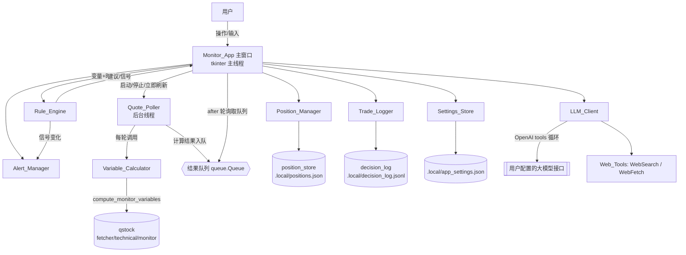
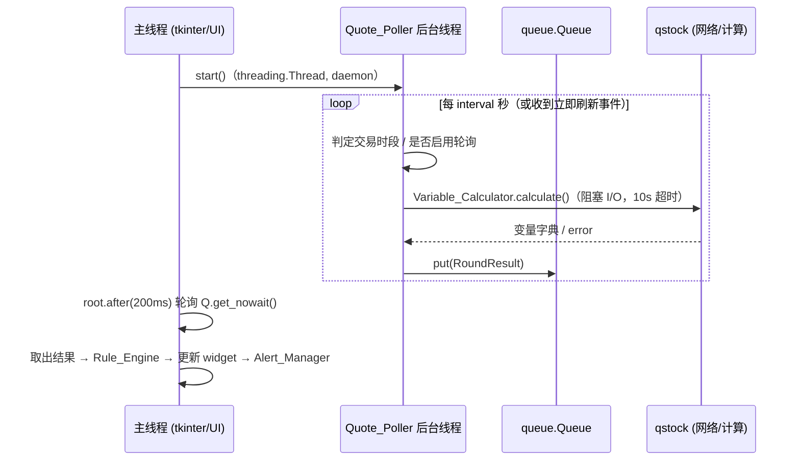
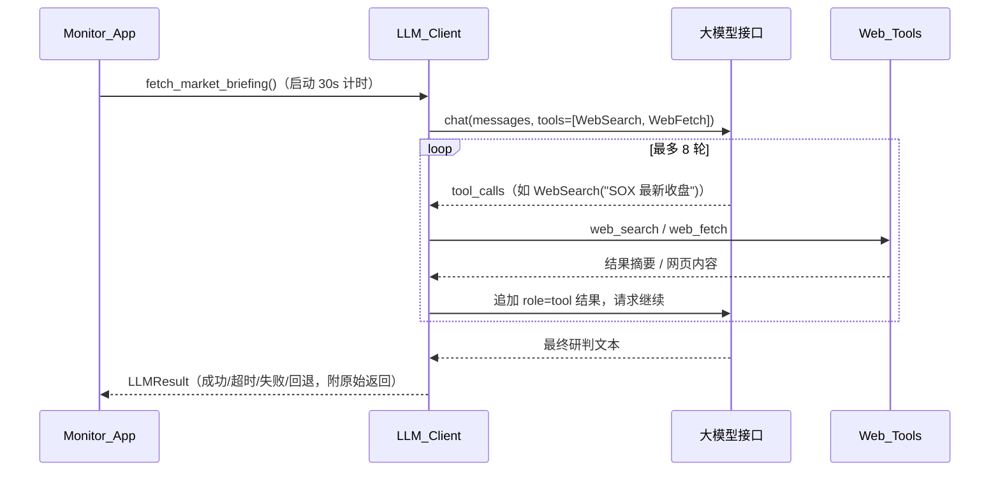

# 设计文档：realtime-monitor-app（588170 本地桌面盯盘应用）

## Overview

（概述）

本设计描述一套基于 **Python + tkinter（标准库）** 的本地桌面盯盘应用 `Monitor_App`，
构建在既有 `semiconductor-monitor` 技能的 `qstock` 包之上。应用面向固定标的 **588170**
科创板半导体 ETF，解决"盘中无法持续获得实时建议、只能反复手动提问"的痛点。

核心思路是**复用而非重写**：行情获取、盯盘变量与技术指标计算、本地持仓持久化、决策
日志等能力全部复用 `qstock` 现有模块（`data/fetcher.py`、`strategy/monitor.py`、
`strategy/position_store.py`、`model/technical.py`），本应用只新增三类逻辑：

1. **交互与展示层**：tkinter GUI（主窗口、持仓表单、设置、交易记录、外盘/新闻面板、
   免责声明）。
2. **调度层**：后台轮询线程 `Quote_Poller`，在交易时段按间隔触发计算，并以线程安全
   方式把结果回送主线程更新 UI。
3. **规则代码化层**：`Rule_Engine` 把 SKILL.md 中原本由 AI 解读的分时段决策树（集合
   竞价情景 1-7、开盘情景 A-F、盘中、尾盘决策树）与买入/卖出/止损信号规则**代码化**，
   按当前交易时段自动匹配建议；`LLM_Client` 复刻技能依赖大模型联网搜索外盘/新闻的方式，
   通过 OpenAI 兼容的工具调用（WebSearch / WebFetch）驱动多轮工具调用循环。

### 设计定位与免责声明

本应用所有输出均基于历史行情数据与技术指标的**规则化计算**，**不构成投资建议**。
免责声明在主界面底部常驻展示，并在首次启动时要求用户显式确认（需求 9）。外盘/新闻等
大模型返回内容一律标注"不确定信息，仅供参考"，且**绝不写入本地持仓记录或止损计算**
（需求 7.12）。

### 关键设计约束（对齐现状）

- **零额外 GUI 依赖**：仅用 tkinter（Python 标准库）。运行期依赖沿用 `qstock` 的
  `pandas` / `numpy` / `requests`，不引入 sklearn / matplotlib。
- **标的固定 588170**：不支持切换标的。
- **本地优先**：除大模型调用外，所有数据处理在本地完成，不额外上传用户数据。
- **复用 qstock 数据契约**：`compute_monitor_variables` 返回的字段名、`价格来源` 三值
  标记、`None` 表示数据不足、`_数据质量_*` 字段、`MonitorInputError` 参数校验、`error`
  字段等契约在本应用中原样沿用。

## Architecture

（架构）

### 代码放置位置与复用方式

在技能根目录下新增一个与 `qstock/` 同级的 GUI 应用包 `app/`：

```
skills/semiconductor-monitor/
├── qstock/                     # 既有：数据/指标/策略/持仓（复用，不改动其对外契约）
│   ├── data/fetcher.py
│   ├── model/technical.py
│   └── strategy/
│       ├── monitor.py          # compute_monitor_variables（复用）
│       └── position_store.py   # save/load/clear_position, append/read_decision_log（复用）
└── app/                        # 新增：tkinter 桌面盯盘应用
    ├── __init__.py
    ├── main_app.py             # 入口：python3 app/main_app.py —— 组装各组件并启动主窗口
    ├── monitor_app.py          # Monitor_App：主窗口、视图、状态编排、UI 更新
    ├── quote_poller.py         # Quote_Poller：后台轮询线程 + 结果队列
    ├── variable_calculator.py  # Variable_Calculator：封装 compute_monitor_variables 调用
    ├── rule_engine.py          # Rule_Engine：交易时段判定 + 决策树 + 信号规则（纯逻辑）
    ├── alert_manager.py        # Alert_Manager：弹窗/高亮/声音 + 去重
    ├── position_manager.py     # Position_Manager：持仓表单校验 + 调用 position_store
    ├── trade_logger.py         # Trade_Logger：交易记录校验 + 调用 decision_log
    ├── llm_client.py           # LLM_Client + Web_Tools（WebSearch/WebFetch）+ 工具调用循环
    ├── settings_store.py       # Settings_Store：应用配置持久化
    └── sound.py                # 跨平台提示音封装
```

**import 复用方式**：`app/main_app.py` 在启动时把 `qstock` 目录加入 `sys.path`
（`sys.path.insert(0, <技能根>/qstock)`），与 `qstock` 内部模块彼此 import 的现有约定
保持一致。各封装组件按如下方式引用既有能力：

```python
# variable_calculator.py
from strategy.monitor import compute_monitor_variables, MonitorInputError
# position_manager.py
from strategy.position_store import save_position, load_position, clear_position
# trade_logger.py
from strategy.position_store import append_decision_log, read_decision_log
```

新增的应用配置文件（大模型接口、轮询间隔等）与 `qstock` 一样存放在技能根目录下的
`.local/`（`app_settings.json`），跟随技能文件夹整体移动，已被 `.gitignore` 覆盖。

### 组件关系图



### 线程模型（tkinter 线程安全）

tkinter **不是线程安全**的：所有 widget 更新必须在主线程完成。因此采用"**后台线程做
I/O + 队列回传 + 主线程消费**"模式：



要点：

- `Quote_Poller` 是一个 `threading.Thread`（`daemon=True`），内部用
  `threading.Event` 控制启停（`stop_event`）与立即刷新（`refresh_event`）。间隔等待用
  `refresh_event.wait(timeout=interval)` 实现，可被"立即刷新"提前唤醒且不忙等。
- 后台线程**只做计算与 I/O，不触碰任何 tkinter widget**；结果封装成 `RoundResult`
  放入 `queue.Queue`。
- 主线程通过 `root.after(200, self._drain_queue)` 周期性地非阻塞消费队列，取到结果后
  在主线程内调用 `Rule_Engine`、刷新 widget、触发 `Alert_Manager`。
- "立即刷新去重"（需求 2.8）：后台线程用 `busy` 标志表示"本轮进行中"，主线程点击立即
  刷新时若发现 `busy` 为真则忽略（不置位 `refresh_event`）。
- 单轮 10 秒超时（需求 2.7）：`Variable_Calculator` 在独立的计算中用带超时的执行方式
  （见组件小节），超时按失败处理并保留上一轮数据。

### 数据流

一轮完整数据流：`Quote_Poller` 触发 → `Variable_Calculator.calculate()` 调
`compute_monitor_variables` 返回变量字典 → 入队 → 主线程取出 → `Rule_Engine` 依据
`当前交易时段 + 变量字典 + 上一轮变量` 产出 `时段建议` 与 `信号列表` → 主线程更新
展示区、并把信号交给 `Alert_Manager` 做去重与提醒。外盘/新闻是**独立按需数据流**：
用户点击"获取外盘与新闻" → `LLM_Client` 在自己的后台线程内跑工具调用循环 → 结果经
队列回主线程展示，与行情轮询互不阻塞。

## Components and Interfaces

（组件与接口）

### Monitor_App（主窗口与编排）

职责：组装所有组件；构建 tkinter 视图（持仓区、变量/指标区、时段建议区、信号区、
外盘新闻区、交易记录区、设置区、常驻免责声明条）；驱动 `root.after` 队列消费与 UI
更新；管理首次启动免责声明确认流程。

```python
class MonitorApp:
    def __init__(self, root: tk.Tk, deps: AppDeps): ...
    def run(self) -> None: ...                       # 显示免责声明确认后进入主界面
    def _show_disclaimer_gate(self) -> None: ...      # 需求 9.3/9.4：确认前不进入主界面
    def _drain_queue(self) -> None: ...               # root.after 周期消费 RoundResult / LLMResult
    def _render_variables(self, r: RoundResult) -> None: ...   # 需求 3
    def _render_advice(self, advice: SessionAdvice) -> None: ...# 需求 4
    def _render_signals(self, signals: list[Signal]) -> None: ...# 需求 5/6
    def _render_llm(self, res: LLMResult) -> None: ...          # 需求 7
```

关键行为映射：

- 需求 3.2/3.3：取到不含 `error` 的结果后在 1 秒内刷新（`after` 周期 200ms，远小于 1s）。
- 需求 3.4：字段值为 `None` 时展示"数据不足暂不可用"。
- 需求 3.5/3.7/10.3/10.6：按 `价格来源` 决定是否显示"当前价可能非实时/请核实"标注。
- 需求 3.6：`_数据质量_检测到拆分跳空` 为 True 时展示 `_数据质量_说明` 原文。
- 需求 3.8/10.1/10.4：结果含 `error` 时显示错误提示并**保留上一轮展示数据不清空**
  （主线程持有 `last_good_result`，仅在成功轮次更新）。
- 需求 9.1/9.2：底部提示条用 `pack(side=BOTTOM, fill=X)` 常驻，视图切换/滚动/缩放
  不遮挡、不截断。

### Quote_Poller（后台轮询线程）

职责：在交易时段按配置间隔触发一轮行情获取与计算；支持启停、立即刷新、单轮超时、
失败重试与保留上一轮数据。

```python
class QuotePoller:
    def __init__(self, calculator: VariableCalculator, result_queue: queue.Queue,
                 get_interval: Callable[[], int]): ...
    def start(self) -> None: ...          # 启动 daemon 线程
    def stop(self) -> None: ...           # 需求 2.5：当前轮完成后停止后续周期
    def request_refresh(self) -> bool: ...# 需求 2.6/2.8：忙时返回 False 表示被忽略
    def _run_loop(self) -> None: ...      # refresh_event.wait(interval) 驱动
```

- 需求 2.1：间隔以 `refresh_event.wait(timeout=interval)` 计时，触发误差 ±1 秒内。
- 需求 2.5：`stop()` 置 `stop_event`；正在进行的一轮跑完后循环退出，不中断当前轮。
- 需求 2.7/10.2/10.5：单轮失败（异常或 10 秒超时）→ 入队 `RoundResult(error=...)`，
  循环继续，下一间隔重试，进程不终止。
- 需求 2.8：`busy` 为真时 `request_refresh()` 直接返回 False（主线程据此不再置位事件）。

### Variable_Calculator（盯盘变量计算封装）

职责：把持仓与止损设定转换为 `compute_monitor_variables` 参数并调用，附加单轮 10 秒
超时控制；额外补充 `Rule_Engine` 信号 5.1/5.2 所需的**上一周期 MACD 柱值**。

```python
class VariableCalculator:
    def calculate(self, position: PositionInput, *, timeout: float = 10.0) -> RoundResult: ...
```

**设计决策（MACD 柱值跨周期条件）**：需求 5.1/5.2 的 MACD 条件定义为"上一周期柱值 < 0
且当前周期柱值 ≥ 0"（卖出为镜像），而 `compute_monitor_variables` 现仅返回当前
`MACD_HIST` 与基于 DIF/DEA 交叉的 `MACD金叉/死叉`。为满足需求且**不改动 qstock 对外
契约**，`Variable_Calculator` 在 `calculate` 内部对已计算的指标 DataFrame 取
`macd_hist` 的最后两根值，向 `RoundResult` 附加 `macd_hist_prev` 与 `macd_hist_curr`
两个派生字段供 `Rule_Engine` 使用。（实现上可让 `Variable_Calculator` 复用
`compute_monitor_variables` 内部同款指标计算路径，或在其返回结果基础上补取上一根柱值；
优先选择不侵入 qstock 的方案。）

- 需求 3.1：返回结构对齐"成功=变量字典 / 失败=含 error 标识"。
- `MonitorInputError`（持仓非正数等）在 `Position_Manager` 校验阶段已拦截，计算阶段
  兜底捕获后作为 error 结果返回。

### Rule_Engine（交易时段判定 + 决策树 + 信号规则，纯逻辑核心）

职责：本应用最核心的**纯函数逻辑**，是属性测试的主要对象。输入"当前时间 + 变量字典
（含上一轮/上一周期派生值）"，输出"所处交易时段、时段建议、信号列表"。不做任何 I/O、
不触碰 UI、不依赖网络，便于 100+ 次随机输入的属性测试。

```python
class TradingSession(enum.Enum):
    CALL_AUCTION = "集合竞价"      # 09:15:00–09:25:59
    OPENING      = "开盘"          # 09:30:00–09:59:59
    INTRADAY     = "盘中"          # 10:00:00–11:29:59, 13:00:00–13:59:59
    CLOSING      = "尾盘"          # 14:00:00–14:59:59
    NON_TRADING  = "非交易时段"    # 其余时间与非交易日

def classify_session(now: datetime, is_trading_day: bool) -> TradingSession: ...

class RuleEngine:
    def session_advice(self, session: TradingSession, vars: dict) -> SessionAdvice: ...
    def evaluate_signals(self, vars: dict, prev_vars: dict | None) -> list[Signal]: ...
```

**时段判定（需求 4.1-4.5）**：`classify_session` 按上表把一天映射到互斥且穷尽的五类
时段。非交易日或落在交易日内的时段间隙（09:26:00–09:29:59、11:30:00–12:59:59、
15:00:00 之后）均归为 `NON_TRADING`。交易日判定通过是否成功取到当日 K 线/行情间接
判断（简单实现：非交易日行情不更新，Rule_Engine 接受布尔入参，由上层根据数据新鲜度
传入；MVP 可先按周一至周五近似，并在设计中标注为可增强点）。

**决策树代码化（需求 4.1-4.4, 4.6）**：把 SKILL.md 的价位比较条件逐条转成
布尔判定，映射到唯一情景/分支：

- 集合竞价情景 1-7：以 `[竞价价]`（=当前价）与关键价位 `[成本+2%]`、`[加权成本]`、
  `[昨收+2%]`、`[昨收-2%]`、`[昨收-2.5%]`、`[昨收-4%]` 的区间归属确定唯一情景。
- 开盘情景 A-F：以 `[开盘价]` 与同组关键价位的区间归属确定唯一情景。
- 尾盘决策树：以 `[当前价]` 相对 `[加权成本]`、`成本×0.98`、`成本×0.96`、`[止损位]`
  的区间归属确定唯一分支。
- 盘中：展示做 T 机会与关键价位突破建议；做 T 份数按需求 4.6 公式
  （可用资金×80% ÷ 做 T 买入位，向下取整）计算——直接复用 `compute_monitor_variables`
  已返回的 `做T可用资金上限` / `做T可买份数`。

实现上每类决策树用**有序的区间边界列表**表达，保证"互斥且穷尽"：给定价格必落入且仅
落入一个区间，杜绝重叠或空档（属性测试重点验证）。

**信号规则代码化（需求 5.1-5.7）**：

- 买入条件集合：RSI<30、KDJ_J<0、当前价≤布林下轨、`macd_hist_prev<0 且 macd_hist_curr≥0`。
- 卖出条件集合：RSI>70、KDJ_J>100、当前价≥布林上轨、`macd_hist_prev>0 且
  macd_hist_curr≤0`、`|(当前价−成本)/成本|×100% < 2`。
- 止损条件：当前价<止损位（需求 5.3）；放量下跌止损：今日成交量>20日均量×1.5 且
  当日跌幅>3%（需求 5.4）。
- 需求 5.5：任一条件所需指标为 `None` 时，该条件既不计成立也不计不成立，直接**排除**
  出该类计数（"可参与条件"集合缩小）。
- 需求 5.6：比较基准（成本/止损位/昨收/20日均量）为 `None` 时跳过依赖它的条件。
- 需求 5.7/5.1/5.2：某类"可参与条件数 < 2"时不生成该类信号；买入/卖出需"≥2 个成立"
  才生成。

`Signal` 携带类型、关联关键价格、触发价、触发时间，供 `Alert_Manager` 去重与展示。

### Alert_Manager（提醒：弹窗/高亮/声音 + 去重）

职责：在信号生成或当前价首次触及关键价位时提醒；对状态未变的信号去重；声音可开关且
跨平台。

```python
class AlertManager:
    def __init__(self, sound_enabled: Callable[[], bool], sound: SoundPlayer): ...
    def process(self, signals: list[Signal], vars: dict, now: datetime) -> list[Alert]: ...
```

- 需求 6.1：信号生成后 2 秒内以应用内弹窗或界面高亮展示，内容含信号类型、标的名称/
  代码、触发价格、触发时间。
- 需求 6.3：当前价"首次达到或穿越"止损位/做 T 买入位/做 T 卖出位之一时提醒，标明触及的
  关键价位类型与价格。"穿越"通过对比上一轮当前价与本轮当前价相对阈值的位置变化判定。
- 需求 6.4/6.5（去重核心）：为每类信号维护"上次已提醒指纹"= `(信号类型, 关联关键价格)`。
  指纹相同则不重复提醒；指纹变化（类型改变或关联关键价格改变）则再次提醒。
- 需求 6.2/6.6：`sound_enabled()` 为真才播放一次 ≤3 秒提示音；关闭则仅弹窗/高亮。

**跨平台声音（sound.py）**：Windows 用标准库 `winsound.Beep` / `PlaySound`；macOS
无 `winsound`，用标准库 `subprocess` 调用系统 `afplay` 播放内置音频（或 `print('\a')`
终端响铃兜底）；Linux 尝试 `paplay`/`aplay`，均不可用时静默降级为仅视觉提醒。封装为
统一 `SoundPlayer.play()`，按 `sys.platform` 选择后端，任何后端异常都不影响主流程。

### Position_Manager（持仓录入与管理）

职责：持仓表单输入校验；调用 `qstock` 持仓持久化；启动时回填。

```python
class PositionManager:
    def load(self) -> PositionInput | None: ...        # 需求 1.2：启动回填
    def validate(self, form: PositionForm) -> ValidationResult: ...  # 需求 1.3/1.4/1.5/1.7
    def save(self, form: PositionForm) -> SaveResult: ...            # 需求 1.1/1.6/1.8
```

校验规则（保存前，全部通过才写入）：

- 需求 1.3：持仓数量 ∈ [1, 1_000_000_000] 的正整数；加权成本 ∈ [0.01, 999_999.99]。
- 需求 1.4：可用资金 ∈ [0, 999_999_999.99] 的非负数。
- 需求 1.5：止损设定三选一（最大亏损比例 / 最大亏损金额 / 直接指定止损价），恰好选一种。
- 需求 1.7：最大亏损比例 ∈ (0, 100]（即 0.01%–100%）；最大亏损金额为正数；直接指定
  止损价为正数且**低于加权成本**。
- 需求 1.1/1.6：校验通过调 `save_position` 覆盖写入 `.local/positions.json`，展示成功
  提示。
- 需求 1.3/1.4/1.7：任一越界→展示指明字段的错误提示、拒绝保存、`positions.json` 内容
  不变（校验在写盘之前完成即可保证原文件不动）。
- 需求 1.8：写盘失败（`save_position` 抛异常）→展示保存失败提示并保留用户已输入内容。

### Trade_Logger（交易记录）

职责：交易记录输入校验；调用 `qstock` 决策日志；读取展示。

```python
class TradeLogger:
    def add(self, action: str, price: float) -> AddResult: ...  # 需求 8.1/8.2/8.3
    def list(self, limit: int = 50) -> list[LogEntry]: ...      # 需求 8.4/8.5
```

- 需求 8.1：操作类型 ∈ {做T买入, 做T卖出, 止损, 减仓} 且价格>0 → 调 `append_decision_log`
  追加写入，2 秒内展示成功提示。
- 需求 8.2：缺操作类型或缺价格→错误提示、不写入。
- 需求 8.3：类型不在集合内或价格非正→错误提示、不写入。
- 需求 8.4：`read_decision_log(code=588170, limit=50)` 读取，按时间由早到晚展示最多
  50 条，每条含时间戳、类型、价格。
- 需求 8.5：无记录→展示空状态提示。

### LLM_Client（外盘/新闻大模型接入 + 工具调用循环）

职责：按 OpenAI 格式调用用户配置的大模型；声明 WebSearch/WebFetch 工具；执行工具、
回传结果，驱动多轮工具调用循环（≤8 轮）；30 秒整体超时；不支持工具则回退直接问答；
容错不编造。

```python
class LLMClient:
    def fetch_market_briefing(self) -> LLMResult: ...   # 在独立后台线程运行，结果入队
    def _chat(self, messages, tools) -> dict: ...        # 单次 OpenAI /chat/completions 调用
    def _run_tool(self, name: str, args: dict) -> str: ...# 分派 WebSearch/WebFetch

class WebTools:
    def web_search(self, query: str) -> str: ...  # 需求 7.3
    def web_fetch(self, url: str) -> str: ...      # 需求 7.4
```

- 需求 7.1：`Settings_Store` 持久化 接口地址/API 密钥/模型名 三项，重启可读。
- 需求 7.2：点击获取→按 OpenAI 格式调用，`tools` 中声明 WebSearch 与 WebFetch，请求
  SOX/北向资金/A50/半导体新闻研判；整体 30 秒响应上限。
- 需求 7.3/7.4：模型请求调工具→执行 `web_search`/`web_fetch`→把结果作为 `role=tool`
  消息回传→继续生成。
- 需求 7.5：`max_tool_rounds=8`；达上限则停止再调工具、要求模型基于已有信息给最终研判。
- 需求 7.6：30 秒内成功返回→展示研判，附"不确定信息，仅供参考"标记与获取时间。
- 需求 7.7：模型不支持工具调用（如接口报错提示 tools 不支持）→回退为不带 `tools` 的
  直接问答，界面提示"本次研判未使用联网工具"。
- 需求 7.8/7.9：三项配置任一为空→阻止调用并提示先完成配置；均已填写→不显示未配置提示。
- 需求 7.10：调用错误/连接失败/返回内容不含 SOX/北向/A50 任一可识别外盘项→展示
  "外盘/新闻数据获取失败"并原样展示模型原始返回，保留界面其他数据不变。
- 需求 7.11：整体（含工具循环）>30 秒→终止本次请求、提示超时，不影响其他数据。
- 需求 7.12：模型/工具返回内容**绝不**写入持仓记录或止损计算，仅作不确定信息展示。

工具调用循环时序：



### Settings_Store（配置持久化）

职责：持久化轮询间隔、大模型接口三项、声音开关等；提供校验。

```python
class SettingsStore:
    def get_interval(self) -> int: ...                 # 默认 60（需求 2.2）
    def set_interval(self, seconds: int) -> SetResult: ...# 需求 2.3/2.4
    def get_llm_config(self) -> LLMConfig: ...          # 需求 7.1
    def set_llm_config(self, cfg: LLMConfig) -> None: ...
    def is_sound_enabled(self) -> bool: ...             # 需求 6.6
    def is_disclaimer_acknowledged(self) -> bool: ...   # 需求 9.3
```

- 需求 2.2：间隔默认 60 秒。
- 需求 2.3：提交 [5, 3600] 的整数→持久化并令下一轮生效。
- 需求 2.4：非整数/<5/>3600→展示"超出 5–3600 秒允许范围"错误提示，保留原间隔不变。

## Data Models

（数据模型）

### 配置结构（.local/app_settings.json）

```json
{
  "poll_interval_seconds": 60,
  "sound_enabled": true,
  "disclaimer_acknowledged": false,
  "llm": {
    "base_url": "",
    "api_key": "",
    "model": ""
  }
}
```

### 持仓结构（复用 qstock，.local/positions.json）

沿用 `position_store.save_position` 既有结构，键为标的代码 `"588170"`：

```json
{
  "588170": {
    "position": 16000,
    "cost": 1.28,
    "cash": 20000.0,
    "max_loss_pct": 10.0,
    "max_loss_amount": null,
    "stop_loss_price": null,
    "updated_at": "2026-01-01T09:00:00"
  }
}
```

`PositionInput`（应用内内存对象）字段与上表一一对应；`PositionForm` 为表单原始字符串
输入，经 `validate` 转换为 `PositionInput`。

### 决策日志结构（复用 qstock，.local/decision_log.jsonl）

沿用 `append_decision_log` 既有每行 JSON：`{time, code, action, price, shares, note}`。

### 盯盘变量结果（RoundResult）

对 `compute_monitor_variables` 返回字典的封装，新增派生字段与错误/时间戳：

```python
@dataclass
class RoundResult:
    ok: bool                      # 是否为成功轮次（无 error）
    vars: dict                    # compute_monitor_variables 原样返回（成功时）
    error: str | None             # 失败原因（含超时）
    price_source: str | None      # realtime / kline_fallback / kline_only
    macd_hist_prev: float | None  # 派生：上一周期 MACD 柱值（需求 5.1/5.2）
    macd_hist_curr: float | None  # 派生：当前周期 MACD 柱值
    fetched_at: datetime
```

### 时段建议对象（SessionAdvice）

```python
@dataclass
class SessionAdvice:
    session: TradingSession
    scenario: str | None          # 如 "情景3" / "开盘情景B" / "尾盘-小亏" / None（数据不足）
    advice_text: str              # 展示给用户的建议正文
    data_available: bool          # 需求 4.7：False 时展示"数据不可用"提示
```

### 信号对象（Signal）与提醒对象（Alert）

```python
@dataclass
class Signal:
    kind: str                     # "买入" / "卖出" / "止损" / "放量下跌止损"
    trigger_price: float
    related_price: float | None   # 关联关键价格（用于去重指纹）
    reasons: list[str]            # 成立的具体条件描述
    triggered_at: datetime

@dataclass
class Alert:
    signal_kind: str
    symbol: str                   # "588170"
    trigger_price: float
    triggered_at: datetime
    play_sound: bool
```

去重指纹：`(Signal.kind, Signal.related_price)`（需求 6.4/6.5）。

### LLM 结果对象（LLMResult）

```python
@dataclass
class LLMResult:
    status: str                   # "success" / "timeout" / "error" / "fallback_no_tools"
    briefing_text: str | None     # 最终研判（success/fallback 时）
    raw_response: str | None      # 原始返回（error 时原样展示，需求 7.10）
    used_tools: bool              # 需求 7.7 展示是否使用联网工具
    tool_rounds: int              # 实际工具调用轮数（≤8）
    fetched_at: datetime
```

## Correctness Properties

（正确性属性）

*属性（property）是指在系统所有合法执行中都应成立的特征或行为——本质上是对"系统应当
做什么"的形式化陈述。属性是人类可读规约与机器可验证的正确性保证之间的桥梁。*

本应用的核心可测逻辑集中在 `Rule_Engine`（时段判定、决策树、信号判断）、`Alert_Manager`
（去重）、各类输入校验与 `LLM_Client` 的工具循环上限等**纯逻辑**上，天然适合属性测试。
以下属性均从验收标准推导（见 prework 分析），每条标注其来源需求。UI 渲染时序、线程定时、
外部接口交互等归为集成/示例测试，不在此列。

### Property 1: 交易时段判定互斥且穷尽

*对任意* 一天中的时间点与交易日标志，`classify_session` 应将其归入五类交易时段
（集合竞价/开盘/盘中/尾盘/非交易时段）中且仅一类；且当归入非交易时段时不产出任何盘中
决策树建议。

**Validates: Requirements 4.5**

### Property 2: 集合竞价情景互斥且穷尽

*对任意* 竞价价格与关键价位组合，`Rule_Engine` 在集合竞价时段应将当前状态匹配到情景
1–7 中且仅一个情景（匹配计数恒为 1）。

**Validates: Requirements 4.1**

### Property 3: 开盘情景互斥且穷尽

*对任意* 开盘价与关键价位组合，`Rule_Engine` 在开盘时段应将当前状态匹配到情景 A–F 中
且仅一个情景（匹配计数恒为 1）。

**Validates: Requirements 4.2**

### Property 4: 尾盘决策树分支互斥且穷尽

*对任意* 当前价、加权成本与止损位组合，`Rule_Engine` 在尾盘时段应将当前状态匹配到尾盘
决策树的唯一一个分支（匹配计数恒为 1）。

**Validates: Requirements 4.3**

### Property 5: 做 T 可买份数计算正确

*对任意* 非负可用资金与正数做 T 买入位，`Rule_Engine` 展示的做 T 可买份数应恒等于
`向下取整(可用资金 × 0.80 ÷ 做T买入位)`。

**Validates: Requirements 4.6**

### Property 6: 数据不足时降级不产出情景建议

*对任意* 当前时段所需关键价位存在 None 的输入，`Rule_Engine` 应返回 `data_available=False`
且不产出该时段的具体情景/分支建议。

**Validates: Requirements 4.7**

### Property 7: 买入信号生成当且仅当成立条件数达标

*对任意* 指标值组合（RSI、KDJ_J、当前价与布林下轨、前后周期 MACD 柱值），买入信号被
生成当且仅当"可参与买入条件数 ≥ 2 且其中成立条件数 ≥ 2"。

**Validates: Requirements 5.1, 5.7**

### Property 8: 卖出信号生成当且仅当成立条件数达标

*对任意* 指标值与成本/当前价组合（RSI、KDJ_J、当前价与布林上轨、前后周期 MACD 柱值、
回本距离），卖出信号被生成当且仅当"可参与卖出条件数 ≥ 2 且其中成立条件数 ≥ 2"。

**Validates: Requirements 5.2, 5.7**

### Property 9: 止损信号生成当且仅当当前价低于止损位

*对任意* 当前价与非 None 的止损位，止损信号被生成当且仅当 `当前价 < 止损位`。

**Validates: Requirements 5.3**

### Property 10: 放量下跌止损信号生成条件

*对任意* 当日成交量、20 日均量、昨收价与当前价（均非 None），放量下跌止损信号被生成
当且仅当 `当日成交量 > 20日均量 × 1.5` 且 `当日跌幅 > 3%`（当日跌幅 =
(昨收价 − 当前价) ÷ 昨收价 × 100%）。

**Validates: Requirements 5.4**

### Property 11: 缺失值稳健性（None 不影响其余判断）

*对任意* 指标/基准值字典，将其中任一项置为 None 后，该 None 项对应的条件既不计入"成立
数"也不计入"可参与数"（可参与集合恰好缩小该条件），而其余条件的判断结果保持不变。

**Validates: Requirements 5.5, 5.6**

### Property 12: 提醒内容包含必需要素

*对任意* 买入/卖出/止损信号，`Alert_Manager` 生成的提醒应包含信号类型、标的代码
（588170）、触发价格与触发时间四项要素。

**Validates: Requirements 6.1**

### Property 13: 首次触及关键价位才提醒

*对任意* 连续两轮的当前价序列与某一关键价位阈值，`Alert_Manager` 应仅在当前价"首次
达到或穿越"该阈值的那一轮产出触及提醒，并在提醒中标明该关键价位类型与价格。

**Validates: Requirements 6.3**

### Property 14: 信号提醒去重（指纹不变不重复、变化必提醒）

*对任意* 连续多轮的信号序列，`Alert_Manager` 应在信号去重指纹（信号类型, 关联关键价格）
首次出现时提醒一次，在指纹保持不变的后续轮次不再提醒，而在指纹发生变化时再次提醒。

**Validates: Requirements 6.4, 6.5**

### Property 15: 价格来源标注映射

*对任意* 价格来源取值，`Monitor_App` 应满足：`realtime` 不显示任何"当前价可能非实时"
标注；`kline_fallback` 与 `kline_only` 显示"当前价可能非实时"标注，其中 `kline_only`
额外提示用户在决策前核实实时行情。

**Validates: Requirements 3.5, 3.7, 10.3, 10.6**

### Property 16: 指标 None 值渲染映射

*对任意* 盯盘变量字典，`Monitor_App` 对每个技术指标字段应满足：值为 None 时渲染为文本
"数据不足暂不可用"，值非 None 时渲染为其数值内容。

**Validates: Requirements 3.4**

### Property 17: 失败轮保留最近成功轮展示值

*对任意* 由成功轮与失败（error）轮任意交错组成的轮次序列，在任一时刻界面展示的盯盘数值
应恒等于该时刻之前最近一次成功轮的数值（失败轮不清空、不覆盖已有展示数据）。

**Validates: Requirements 3.8, 10.4**

### Property 18: 轮询间隔校验

*对任意* 提交的轮询间隔输入，`Settings_Store` 应接受并持久化当且仅当其为 [5, 3600]
（含端点）区间内的整数；否则拒绝并保持原间隔不变。

**Validates: Requirements 2.3, 2.4**

### Property 19: 持仓数量与成本校验

*对任意* 持仓数量与加权成本输入，`Position_Manager` 应通过校验当且仅当 持仓数量为
[1, 1_000_000_000] 内的正整数 且 加权成本为 [0.01, 999_999.99] 内的数；任一越界则拒绝
保存且不修改 `.local/positions.json`。

**Validates: Requirements 1.3**

### Property 20: 可用资金校验

*对任意* 可用资金输入，`Position_Manager` 应通过校验当且仅当其为 [0, 999_999_999.99]
内的非负数；否则拒绝保存且不修改 `.local/positions.json`。

**Validates: Requirements 1.4**

### Property 21: 止损设定三选一与数值边界

*对任意* 止损三字段（最大亏损比例、最大亏损金额、直接指定止损价）的取值组合，
`Position_Manager` 应通过校验当且仅当 恰好一个字段非空 且 该字段满足其边界（比例 ∈
(0, 100]、金额为正数、止损价为正数且低于加权成本）；否则拒绝保存。

**Validates: Requirements 1.5, 1.7**

### Property 22: 交易记录输入校验

*对任意* 操作类型与成交价格输入，`Trade_Logger` 应通过校验并写入当且仅当 操作类型 ∈
{做T买入, 做T卖出, 止损, 减仓} 且 成交价格为大于 0 的数值；否则拒绝且不写入本地日志。

**Validates: Requirements 8.2, 8.3**

### Property 23: 交易记录展示排序与截断

*对任意* 已保存的交易记录集合，`Trade_Logger` 展示的列表应按时间由早到晚（非降序）
排列、长度为 `min(记录数, 50)`、且恰为时间上最近的至多 50 条。

**Validates: Requirements 8.4**

### Property 24: 工具调用循环轮数上限

*对任意* 持续在每轮响应中请求调用工具的模型行为，`LLM_Client` 单次外盘/新闻获取实际
执行的工具调用轮数应不超过 8，且在达到上限后停止再声明/执行工具、转为要求模型基于已有
信息给出最终研判。

**Validates: Requirements 7.5**

### Property 25: LLM 配置完整性门控

*对任意* 大模型三项配置（接口地址、API 密钥、模型名称）的空/非空组合，`Monitor_App`
应允许发起调用当且仅当三项全部非空；存在任一为空则阻止调用并提示先完成配置，全部非空
则不显示未配置提示。

**Validates: Requirements 7.8, 7.9**

### Property 26: 外盘研判失败判定

*对任意* 模型返回文本，`Monitor_App` 应判定为"外盘/新闻数据获取失败"当且仅当返回内容
不包含 SOX 指数、北向资金、A50 期货中的任一可识别外盘数据项；判为失败时原样展示原始
返回并保留界面其他数据不变。

**Validates: Requirements 7.10**

## Error Handling

（错误处理策略）

错误处理遵循"**局部降级、保留可用状态、如实提示、绝不编造**"原则，与 `qstock` 既有
容错契约一致。

### 行情获取与计算错误

- **单轮失败/超时（需求 2.7, 10.2, 10.5）**：`Quote_Poller` 每轮在 `try/except` 中调用
  `Variable_Calculator`，并施加 10 秒超时。任何异常或超时都封装为 `RoundResult(ok=False,
  error=...)` 入队；后台循环**不因单轮失败退出**，下一间隔继续重试，进程保持运行。
- **保留上一轮数据（需求 3.8, 10.1, 10.4）**：主线程持有 `last_good_result`，仅在成功
  轮更新。失败轮只在错误提示区显示失败原因，不清空/覆盖已展示数值（Property 17）。
- **参数错误（MonitorInputError）**：持仓非正数等在 `Position_Manager` 校验阶段已拦截；
  即便漏网，`Variable_Calculator` 也会捕获并作为 error 结果返回，不使线程崩溃。
- **数据质量降级（需求 3.4, 3.6, 3.5/10.3/10.6）**：指标为 None → "数据不足暂不可用"；
  检测到拆分跳空 → 原样展示 `_数据质量_说明`；价格来源非 realtime → 标注可能非实时/请
  核实。均为如实呈现 `qstock` 返回的降级信息，不做二次估算。

### 规则引擎的缺失值处理

- 关键价位为 None → 该时段不产出情景建议、提示不可用（需求 4.7）。
- 信号判断中某条件的指标/基准为 None → 该条件被排除出成立数与可参与数（需求 5.5, 5.6）；
  可参与数 < 2 时不生成对应信号（需求 5.7）。所有比较在取值前先判 None，杜绝
  `None` 参与数值比较导致异常。

### 提醒错误

- 声音后端在任一平台不可用或抛异常时静默降级为仅视觉提醒，不影响信号展示与主循环。

### 大模型接入错误

- **配置缺失（需求 7.8）**：三项任一为空即阻止调用并提示。
- **模型不支持工具（需求 7.7）**：捕获"tools 不支持"类错误后，去掉 `tools` 字段重发一次
  直接问答，界面标注"未使用联网工具"。
- **调用/连接错误、无可识别外盘项（需求 7.10）**：展示"外盘/新闻数据获取失败"，原样
  展示模型原始返回供核实，界面其他数据不受影响。
- **整体超时 30 秒（需求 7.11）**：终止本次请求，展示超时提示，不影响其他数据。
- **工具循环上限（需求 7.5）**：达 8 轮强制收敛为最终研判，防止无限循环。
- 所有 LLM 相关错误均只影响外盘/新闻面板，与行情轮询、持仓、信号等**互相隔离**；且
  LLM 返回内容绝不写入持仓/止损计算（需求 7.12）。

### 持仓与交易记录错误

- 输入校验失败 → 明确指出越界字段、拒绝保存、保留原文件与用户输入（需求 1.3/1.4/1.7/1.8,
  8.2/8.3）。
- 写盘异常（需求 1.8）→ 展示保存失败提示并保留用户已输入内容。

### 进程级健壮性

- 后台线程为 `daemon`，主窗口关闭即随进程退出；后台线程内所有循环体都被 `try/except`
  包裹，单轮异常只记录并降级，绝不导致整应用崩溃（需求 2.7, 10.2, 10.5）。

## Testing Strategy

（测试策略）

采用**单元测试 + 属性测试**双轨，互补覆盖：单元测试覆盖具体示例、边界、错误分支与集成
点；属性测试覆盖纯逻辑的普遍正确性。

### 属性测试（Property-Based Testing）

- **库选型**：Python 使用 [Hypothesis](https://hypothesis.readthedocs.io/)。不自行实现
  属性测试框架。
- **迭代次数**：每个属性测试至少运行 100 次随机迭代（`@settings(max_examples=100)`）。
- **标注格式**：每个属性测试以注释标注对应设计属性：
  `# Feature: realtime-monitor-app, Property {number}: {property_text}`。
- **单测对应**：每条 Correctness Property 用**单个**属性测试实现（Property 1–26）。
- **测试对象与生成器**：
  - `Rule_Engine` 为纯函数，测试时直接构造变量字典与时间点，无需网络/UI。
  - 生成器需覆盖：随机价格与关键价位（含相等、临界、跨越边界）、指标含 None 的组合、
    时段判定覆盖全天 00:00:00–23:59:59 与交易日/非交易日、持仓与止损各字段的越界与合法
    取值、模型返回文本（含/不含 SOX/北向/A50 关键词）、持续请求工具的 mock 模型。
  - 决策树"互斥穷尽"属性（Property 2/3/4）通过"匹配情景计数 == 1"断言，是发现区间重叠
    或空档的关键手段。
  - 缺失值稳健性（Property 11）通过"置 None 前后其余条件判断不变"的差分断言验证。

### 单元测试（Example / Edge / Integration / Smoke）

- **Example**：持仓保存/回填/覆盖（1.1/1.2/1.6）、写盘失败（1.8）、计算调用封装（3.1）、
  拆分跳空展示（3.6）、盘中做 T 建议文本（4.4）、声音开关（6.2/6.6）、LLM 三项配置往返
  （7.1）、WebSearch/WebFetch 分派（7.3/7.4）、成功展示与不确定标记（7.6）、不支持工具
  回退（7.7）、LLM 隔离不写盘（7.12）、交易记录保存与空状态（8.1/8.5）、免责声明门槛
  （9.1/9.3/9.4）、历史数据失败提示（10.1）。
- **Integration**：轮询间隔触发误差（2.1）、停止/立即刷新/忙时忽略（2.5/2.6/2.8）、单轮
  超时与失败重试（2.7/10.2/10.5）、成功结果 1 秒内渲染（3.2/3.3）、OpenAI 请求体含 tools
  与 30s 超时（7.2）、整体 30s 超时（7.11）。这些用较短参数与 mock 的 calculator/HTTP
  执行 1–3 个代表性用例，不做 100 次迭代。
- **Smoke**：间隔默认 60（2.2）、底部提示条随视图切换常驻（9.2）。

### mock 与隔离策略

- `Variable_Calculator` 对 `compute_monitor_variables` 的调用在单测中 mock，使
  `Quote_Poller`/`Monitor_App` 逻辑与网络解耦。
- `LLM_Client` 对 HTTP 调用与 `Web_Tools` 在单测中 mock，验证工具循环、上限、回退、超时、
  失败判定等分支，不发起真实网络请求。
- tkinter 渲染类断言在可行范围内通过读取 widget 文本进行；纯布局/视觉项（9.2）以 smoke
  方式人工确认。

### 免责声明与合规

所有测试与实现均以"输出不构成投资建议"为前提；外盘/新闻研判在 UI 与数据模型层强制携带
不确定标记，测试用例覆盖该标记的存在性（7.6）与 LLM 内容不落盘的隔离性（7.12）。
